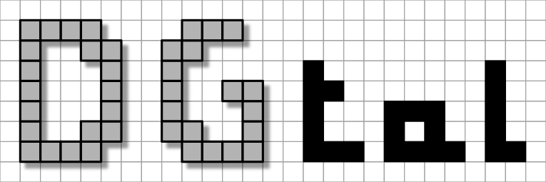

Main website: [https://dgtal.org](https://dgtal.org)

[](https://github.com/DGtal-team/DGtal/actions/workflows/build-PR-main.yml) [](https://github.com/DGtal-team/DGtal/actions/workflows/deployDoc-main.yml)[](https://github.com/DGtal-team/DGtal/actions/workflows/pythonBindings-Pypi.yml)

Description
===========

DGtal is a generic open source library for Digital Geometry
programming for which the main objective is to structure different
developments from the digital geometry and topology community. The
aims are numerous: make easier the appropriation of our tools for a
neophyte (new PhD students, researchers from other topics,...), permit
better comparisons from new methods with already existing approaches
and to construct a federative project. Another objective of DGtal is
to simplify the construction of demonstration tools to share new
results and potential efficiency of the proposed work.

DGtal received the [Symposium on Geometry Processing Software Award in 2016](http://awards.geometryprocessing.org/).

Quick Build Instructions
========================

More details are given in the [documentation pages](http://dgtal.org/download/). We just sketch the main instructions on linux/unix-based systems:

```shell
git clone https://github.com/DGtal-team/DGtal.git
cd DGtal ; mkdir build ; cd build
cmake ..
make install
```

Minimum system requirements: C++20 enabled compiler, [cmake](http://cmake.org).

DGtal can be compiled on Microsoft Windows system using Visual Studio 2014 (or newer): Generate the Visual Studio project using windows [cmake](http://cmake.org) tool and compile the DGtal solution (you may also need to set the cmake variable ```DGTAL_BUILD_SHARED_LIBS``` to false).


Docker
======

A Docker file is included in the repository in order to allow the users to build a docker image with the DGtal library installed. Inside the docker container, the library is installed with many optional dependencies (eigen, cgal, itk, cairo, polyscope, openmp, fftw3) so the user can start developing without the need to install DGtal on the system.
                                                                                                                                                                                                                        
To build the Docker image, Docker should have been installed in the system (to [install Docker](https://docs.docker.com/engine/install/)) download the *Dockerfile* inside the [DGtal repository](https://github.com/DGtal-team/DGtal), in the same directory where the Dockerfile is located execute    

```shell
docker build -t dgtal:latest .
```
To run an interactive terminal inside the docker container and see the examples 
```shell
docker run -it --user=digital dgtal:latest bash
cd /home/digital/git/DGtal/build/examples
```

More Information
================

* Project homepage http://dgtal.org
* Related DGtalTools project: http://dgtal.org/dgtaltools, [DGtalTools](https://github.com/DGtal-team/DGtalTools), [DGtalTools-contrib](https://github.com/DGtal-team/DGtalTools-contrib)

* Release 2.1 [](https://doi.org/10.5281/zenodo.17910944)
* Release 2.0 [](https://doi.org/10.5281/zenodo.15838861)
* Release 1.4 [](https://doi.org/10.5281/zenodo.11550945)
* Release 1.3 [](https://doi.org/10.5281/zenodo.7331486)
* Release 1.2 [](https://doi.org/10.5281/zenodo.4892404)
* Release 1.1 [](https://doi.org/10.5281/zenodo.4075246) 
* Release 1.0 [](https://doi.org/10.5281/zenodo.2611275)
* Release 0.9.4 [](https://doi.org/10.5281/zenodo.1203577)
* Release 0.9.3 [](https://doi.org/10.5281/zenodo.290419)
* Release 0.9.2 [](http://dx.doi.org/10.5281/zenodo.56430)
* Release 0.9.1 [](http://dx.doi.org/10.5281/zenodo.45125)
* Release 0.9 [](http://dx.doi.org/10.5281/zenodo.31884)
* Release 0.8 [](https://doi.org/10.5281/zenodo.11586)

